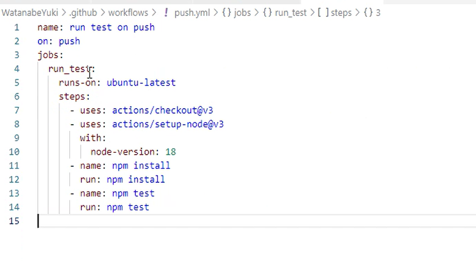
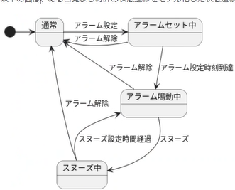

ch08 question

1. JavaScriptにオーバーロードってないの？
   A. ない。内部分岐でわけまけるか、それともすべてメソッドにするか。→メソッドにしたほうがわかりやすい。
   ただしTypeScriptにはオーバーロードの機能が備わっている。

2. 残余パラメータを防御的コピーする必要はある？
   A. 必要ない？防御的コピーをする場合はリストとかを参照する機会があるが残余パラメータはとくにない？
   　ただし、残余パラメータはシャローコピーになるので、これは対策が必要。

3. インライン化とは？
   function foo(X) { return x + 2}

ch08 programming
ex02. 

ex09. 型定義をしっかりと考えてあげるといい。

ch09 question

1. range.method、によるくくりはあまりつかわない

2. クラスの継承とプロトタイプの継承は別のもの？
   JavaScriptで同じプロトタイプのもが継承されているか確認するには、2つのプロトタイプが完全に同一のものであれば
   同一のものとみなされる。

3. constructorプロパティが無い場合、range1.constructor === range2.constructorという判定がうまくいかない場合がある。
   まだnodeとかjQueryがconstructorを使って比較する場合もあるので、その点には注意しなきゃいけない。

4. トップレベルで提示したものだけ公開APIとして提示する。

ch09 program

1. staticで定義したものはインスタンス化しなくても使用可能。テストプログラムとかを走らせた場合、Cとかを走らせてない場合はこうなる。
2. コンポジションを使うか、継承を使うか
   基本コンポジションで実装できるものはこっちを使う(使い勝手がいいから)。商品コードをJavaで書いた場合や認小機能などの社内向けのフレームワークを書くときに継承を使わざるを得ない場面があった。仕様を理解した上で、必要なところでピンポイントで継承くぉつかう。
   ★グッドコードバッドコードという書籍がコーディングをする上で非常に評価が高い。

3.状態遷移図

　引き継ぐような値があった場合、通常を経由してアラームをセットした場合、そういう状態を直接呼び出す形でアプローチをしてあげると最適になる可能性がある。

4. SOLID原則
   これは要チェック。JavaScriptだけではなく、他の言語でも適用できるものになる。
   これの学習はClean Architecture

5. 即時関数→アシンク/アウェイト関数で使う。

6. 継承を使う場合、設計で崩れる場合がある。プロジェクトのグループの中でお互いに齟齬が生じてしまい、クラスの継承が崩れる場合がある。
   今携わってるプロジェクトにもよる。将来起こる変更を予測できない現状がある。

7. テストファーストの考え方を基にコーディングを行うと非常にやりやすい。
テストファーストのいい点は、1回テストを失敗させてみる方法がある。例えば自動テスト自体が間違ってしまっていることとかもある。
先にインターフェースを決めてから書くことを目標にやっていくのが前提にあると思う。
